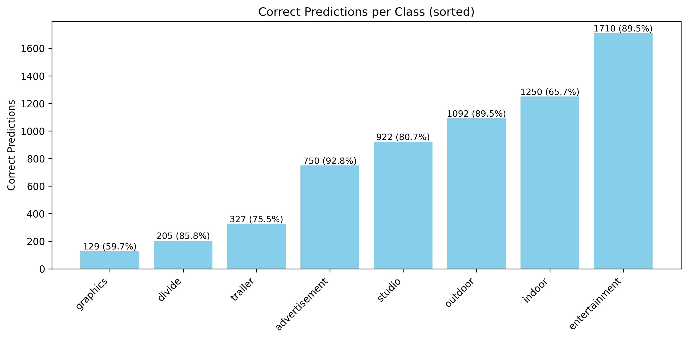
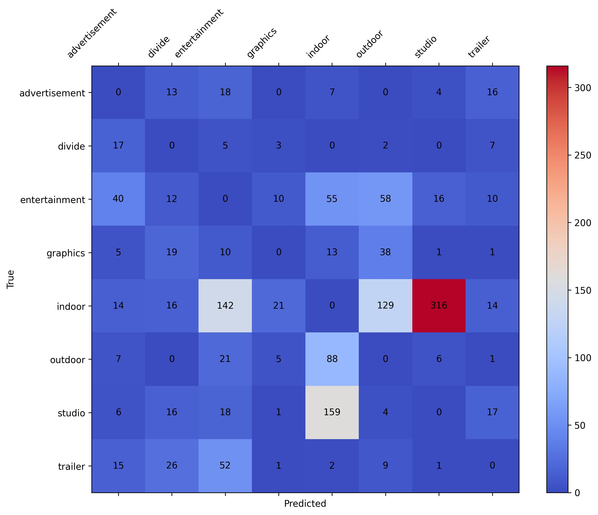
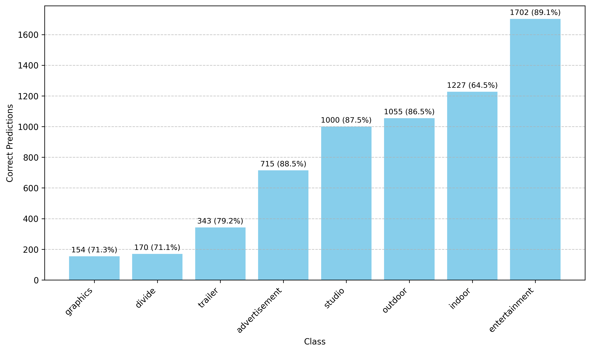
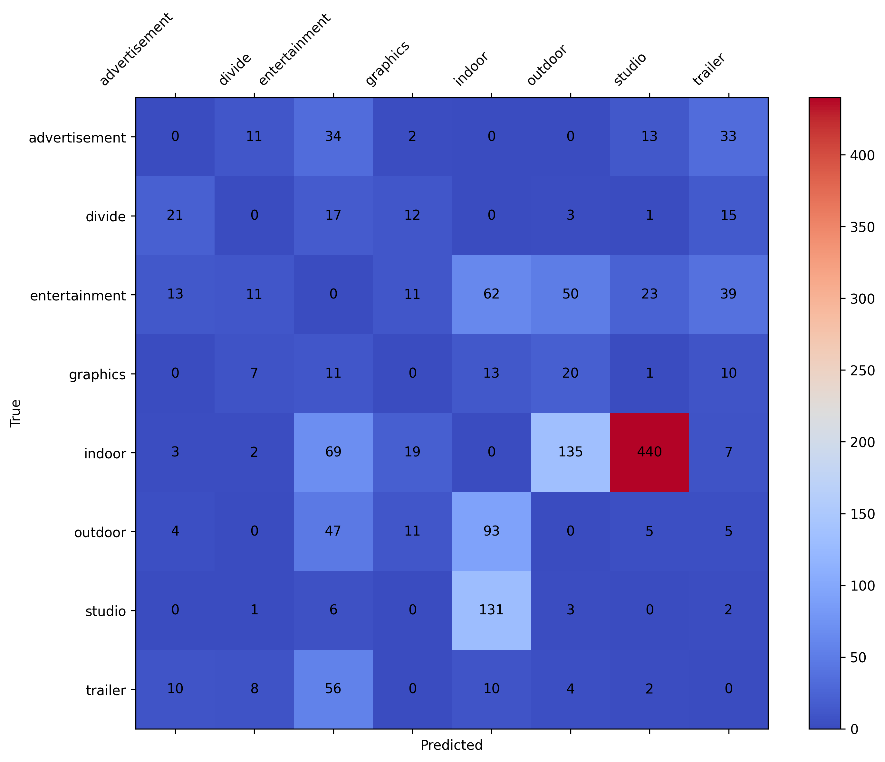

# TV Feed Classification – ViViT & VideoMAE
Tento projekt implementuje a porovnává dvě moderní transformerové architektury pro klasifikaci scén v televizním vysílání: Video Vision Transformer (ViViT) a Video Masked Autoencoder (VideoMAE).

# Popis projektu
Cílem je automaticky klasifikovat krátké úseky televizních záznamů do předdefinovaných tříd na základě vizuálních dat.
Projekt obsahuje:

Kompletní datové zpracování a přípravu datasetu

Implementaci modelů ViViT a VideoMAE

Trénování a vyhodnocení modelů

Analýzu výsledků a porovnání výkonu

# Instalace
Naklonujte repozitář:
```
git clone https://github.com/JanKovarx/TV_feed_classification_ViViT_VideoMae.git
cd TV_feed_classification_ViViT_VideoMae
```
Nainstalujte závislosti:
```
pip install -r requirements.txt
```
## Spustění trénování:
```
python3 run_train_vivit.py
-- používá config_vivit.yaml
python3 run_train_Vmae.py
-- používá config_Vmae.yaml
```
Pro Metacentrum:
```
qsub run_train_vivit.sh
qsub run_train_Vmae.sh
```
## Soubory pro spuštění testování:
Nachází se ve složce output_test_dataset spolu s výsledky natrénovaných modelů

# Dataset
181 videí z různých televizních stanic s celkovou délkou 178.77 hodin

Anotace do 8 tříd (studio, indoor, outdoor, předěl, reklama, upoutávka, grafika, zábava)

Přísné rozdělení datasetu na trénovací, validační a testovací část bez sdílených videí

# Modely
## ViViT
Architektura factorised encoder

Inicializováno z vit_b_16 předtrénovaného na ImageNet-1K

## VideoMAE
Předtrénováno na Kinetics-400 v self-supervised režimu

Použita Base varianta (videomae-base)

# Výsledky
|Metric | ViViT | VideoMAE |
|-------|-------|----------|
|F1 score | 80.8% | 79.6% |
|Accuracy | 81.1% | 79.9% |
|Precision | 81.2% | 80.3% |
|Recall | 81.1% | 78.9% |
|Loss | 1.07 | 1.11 |
|Overall success rate | 81.1% | 80.9% |

## Správné klasifikace ViViT


## Matice záměn ViViT


## Správné klasifikace VideoMae


## Matice záměn VideoMae

